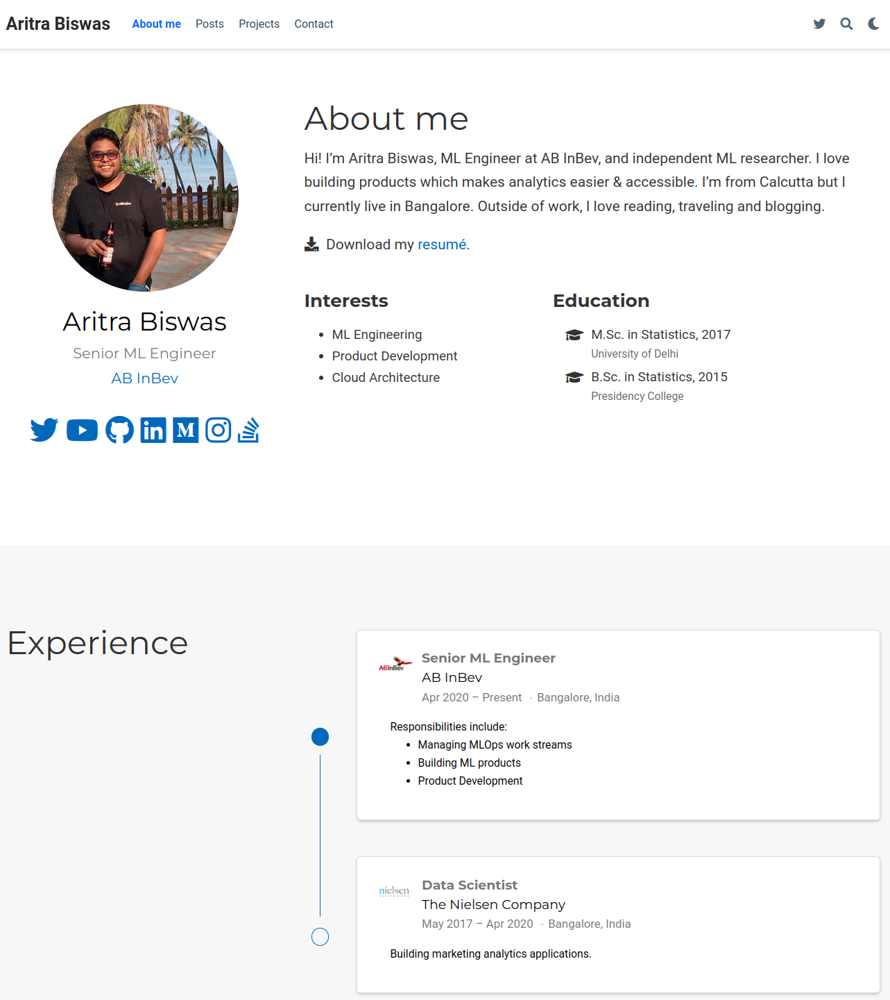
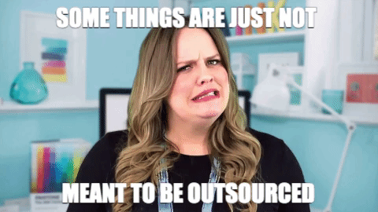
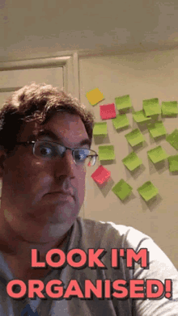
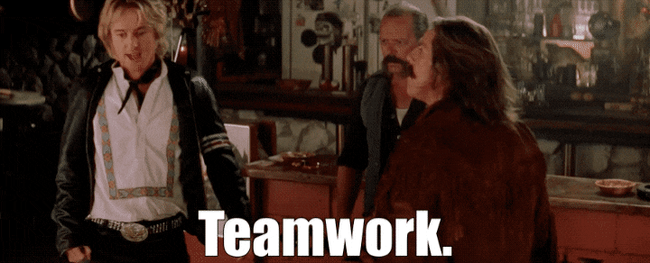
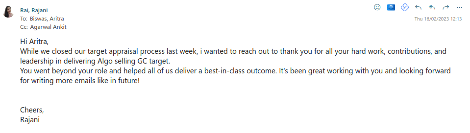
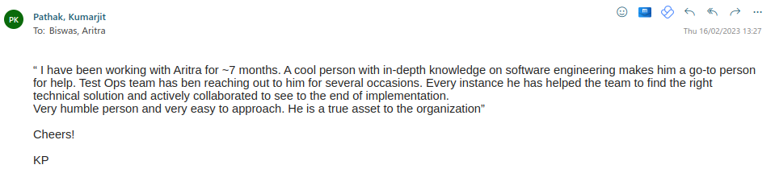
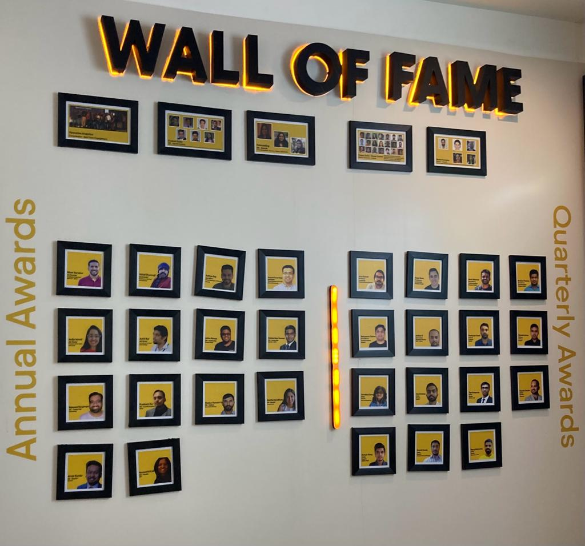

## __Leadership Development Program 2.0__

---

## __About me__

---

## __Scenario:__

Till August 2022, I was leading MMM SE chapter with three user facing product (MMM, MBA and GRA). It was one of the first engineering teams in GAC with a strong focus on UI/UX. In September 2022, I was moved to a new role as ML engineering lead for AlgoSelling (BEEs B2B recommendation engine). I was responsible for building a team and the end to end delivery of the ML Library for Global AlgoSelling Deployment team.

---

## Really!!!!:roll_eyes:

---

In this role I was responsible for the following:

* Work with the business to understand the requirements and translate them into technical specifications.
* Work with the data science team to understand the data and the algorithms.
* As member of engineering team to understand the architecture and the technical constraints. Build the ML library by leveraging the existing in-house and open source resources to democratize the ML capabilities across the organization. Also take user experience and automation into account so that the ML library can be used by technical and non-technical users.

---

* Work closely with the data engineering team to understand the data pipeline and the data quality requirements.
* Work closely with platform team to understand the platform requirements.
* Build a team of software engineers and ML engineers to deliver the ML library.

---

## Thats all, huh :face_with_head_bandage:

---

## __Category: Team Management, Change Management, Digital Knowledge, Talent Development__

---

### __Action:__

* Hiring a team of vendors to immediately start the project. Onboard them with various learning resource relevant to the project. Also, introduced some of the best practices in the team so that their delivery fits into the the long term vision to the product.

### __Process:__

* Working with the hiring team to hire the right talent for the team was the priority. Also, our current system understanding and processes were documented and shared with the LND team and bootcamp team, so a  standard learning track for ML engineers in GAC can be made readily available.

### __Impact:__

* I was able to hire 3 new members in 3 months. Also, used this opportunity to configure hackerrank to streamline the hiring process and reduce the time to hire.
---

## But :vomiting_face:

---

## __Category: Agile, Customer Focus, Accountability, Execution, Innovation__

---

&nbsp;

### __Action:__

* To start this project from scratch, I wore multiple hats as a PO, SM, Architect, Developer etc. In this process, had to work closely with ML platforms team, stakeholders to understand the requirements and the constraints.

### __Process:__

* Introduced the concept of MVP to the team, so that they can deliver the product in a faster way. Started agile practices with minimum viable product and iterated over it to deliver a matured product.

### __Impact:__

* Was able to ship the ML library in 4 months. Also, developed a standard process for the team to deliver the product in a streamlined manner. With enriched documentation onboarding new members became much easier.

---

## Building an agile team :exploding_head:

---

## __Category: Analytical thinking, innovation, problem solving__

---

### __Action:__

* To deliver the product with a lean team, I had to do a significant amount of research on the existing open source libraries and in-house processes to understand the pros and cons of each of them. This helped to make better decisions on how to scale the solution across multiple platform, geography, teams which supports different modes of execution.

### __Process:__

* Created a process of inner sourcing in a way the above criteria can be met and product can be delivered in a efficient and faster way.

### __Impact:__

* The existing library has less code duplication. Uses open source libraries in a way so that it can be extended to support different use cases. It reduces learning curve involved for an end user and make the solution more accessible for the larger audience.

---

## Team work :muscle:

---

## Testimonials :sunglasses:

---

## Testimonials :sunglasses:

---
## Testimonials :sunglasses:

---

## Thank you :pray:

